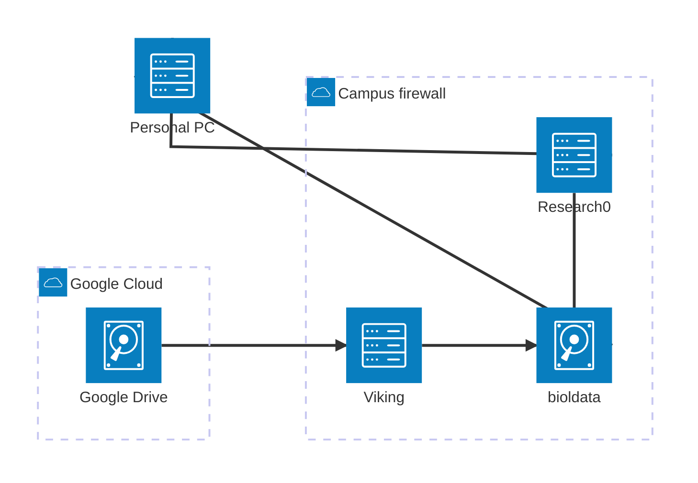

# CellPhe Data Pipeline

Runs a timelapse through the full CellPhe pipeline, including:

  - Image processing
  - Segmentation
  - Tracking
  - Frame feature extraction
  - Time-series feature extraction
  - QC report generation

This is run using `Nextflow` which provides several useful features:

  - Submits jobs to Slurm without having to write any submission scripts
  - Can resume failed pipelines from the previous succesfully completed step
  - Can automatically send emails upon completion/failure

# Prerequisites

  1. Mapping bioldata network share
  2. Ensuring access to `research0`
  3. Ensuring access to `Viking`
  4. Adding public/private key authentication

## Mapping bioldata network share

To be able to access the CellPhe folder on your personal computer,  map the `bioldata` network drive following the instructions on the [University's documentation](https://support.york.ac.uk/s/article/Filestore-How-to-map-a-drive-Windows), using the path `\\storage.its.york.ac.uk\bioldata\bl-cellphe`.
**NB: you'll need to either be wired onto the campus network or connected to the VPN to connect to the network drive**.

## Ensuring access to `research0`

`research0` is a powerful Linux computer that resides on Campus that can be used for research purposes, typically executing long-running programs to free up your personal computer or to access licenced software.
It is used for the data pipeline as it is on the fast campus connection to the Viking service and it means you don't need to leave your laptop running while the pipeline executes.

All members of the University should be able to access `research0` **provided you are connected to Eduroam or are on the [VPN](https://www.york.ac.uk/it-services/tools/vpn/)**.
If you are on Windows open up PowerShell (NB: I highly recommend changing the background to black), Mac users can use the Terminal, and run `ssh <username>@research0`.
As shown below, this should ask for your password and then display a welcome message. 


If this doesn't work, follow the [documentation on the Wiki](https://uoy.atlassian.net/wiki/spaces/RCS/pages/39158543/Accessing+the+Servers).

## Ensuring access to Viking

Unlike `research0`, access to Viking is granted upon request rather than by default.
Ensure you have applied via [this form](https://docs.google.com/forms/d/e/1FAIpQLSfXkL10ypU6EQCBB2jS5oDwTpRMo77ppl7dvdbLnXm5zrKR7Q/viewform), with the Project Code `biol-imaging-2024`.
We don't need access to any restricted licenced software.
Once this has been granted, you can SSH into Viking in the same way as `research0`.


## Adding public/private key authentication

The final step of preparation is to facilitate password-less SSH connection from `research0` to `Viking` so that the entire pipeline can be run without any user input.
This is an alternative form of authentication to username & password which creates a pair of two 'keys', a public and a private.
The private one is associated with a specific machine (in this instance `research0`) and the public one is distributed to anywhere you wish to connect to (in this instance Viking, but it can also be used to authenticate to GitHub).

Run the following instruction on `research0` to create the pair, accepting the defaults for the 3 options (location, passphrase, passphrase confirmation):

`ssh-keygen -t ed25519 -C "research0"`

The public key now needs to be placed onto Viking so your user can be authenticated from `research0`.
Run `nano ~/.ssh/id_ed25519.pub` to open the key in the Nano text editor (still on `research0`). 
Highlight the text with the cursor and right click to copy it, then exit Nano with Ctrl-X

Now SSH into Viking and run the following command to open the Authorized Keys file, which is where the SSH command looks to see if the connecting machine has a registered SSH key: `nano ~/.ssh/authorized_keys`
By default there is already a key present: the "Flight HPC Cluster Key", so press the down arrow key to move to a new line and then right click to paste your `research0` key.
Save this with Ctrl-O then Enter, then exit Nano with Ctrl-X.

If you now disconnect from Viking (Ctrl-D) and try to reconnect, it should login you in using your SSH keys without needing your password.
If this doesn't work, try again or ask for help in Slack.

# Running the Pipeline

  - Creating an Experiment folder (if needed)
  - Identifying the timelapse
  - Creating a config file for the run
  - Navigating to the launch directory
  - Running the pipeline

## Creating an Experiment folder

Each run of the microscope is termed an 'Experiment', and all of its raw and processed data is stored together in a folder in the 'Experiments' sub-folder in the network share.
First check that there isn't an experiment folder for the dataset you are about to process.
Look in the [Experiment Log](https://docs.google.com/spreadsheets/d/1BZNBhHIMR8uBYqgkM81DA0BgXtR4CElyHNOgvvTQre0/edit?gid=0#gid=0) and see if the 'Processed with CellPhe Pipeline' columns for either Phase or Brightfield are ticked.
If they are, then the 'Experiment Name' folder will give the folder name to use.
If not, create a new sub-folder in Experiments with a name following the convention `<date>_<name>_<cell_line>_<microscope>`, e.g. `20240317_dose_response_mcf7_livecyte` and add this to the Experiment Name column in the spreadsheet.

## Identifying the timelapse

While an Experiment comprises a single run of the microscope, this generates multiple different timelapses, i.e. the LiveCyte is run on different wells simultaneously and outputs both phase and brightfield images.
The pipeline is run for one timelapse at a time (although multiple timelapses can be run manually in parallel, more on that later).
The next step then is to identify which timelapse this pipeline run will process.

Using as an example the LiveCyte dataset from 14-06-2024 on MDA-MB-231, clicking the [Google Drive link](https://drive.google.com/drive/folders/1-KBOvEtEAx1b7FpSlMzMCsIrasAw0PWp?usp=drive_link) in the spreadsheet takes us to a folder in Google Drive.
From here we click through until we reach the folder with the images themselves, located at [Raw Data/2024-06-14_15-18-15/Images](https://drive.google.com/drive/folders/11rMHhF8fWPutVpvdzdWZy2-14ompW8Wc).
This folder contains multiple timelapses from different wells and modalities, such as `C5_7_Phase`, `C5_7_Brightfield`, `C4_5_Phase`, `C4_5_Brightfield`.
We'll run the `C4_5_Phase` timelapse first.

So that the pipeline can retrieve the images, it needs the Google Drive folder ID.
This is obtained from the last part of the URL as shown below, and is `11rMHhF8fWPutVpvdzdWZy2-14ompW8Wc`.


## Creating a config file

Each pipeline run is governed by a large number of parameters for the segmentation, tracking, and CellPhe feature generation, which are provided in a separate config file per run.
Typically, there are only two values that change run-to-run: the segmentation model used and the minimum number of frames that a cell must be observed in.

The choice of segmentation model is largely driven by the imaging modality used: phase images tend to use the `cyto3` model, and brightfield (specifically from the ioLight) use our custom CellPose model.
The minimum number of frames is 50 by default, but for shorter time-series that don't have this many frames it will be necessary to reduce it, ideally to no lower than 10 as otherwise some of the time-series features struggle to compute.

To create a config file, copy the template config file for your segmentation model from the `bl-cellphe/CellPhe-data-pipeline/templates` folder, either `cyto3.json` or `iolight.json`, into the `configs` subfolder of your Experiment folder (you'll need to create this if it doesn't exist already), and give it a sensible name corresponding to the specific timelapse.
I.e. for the LiveCyte dataset mentioned before, the full path to the config file is `bl-cellphe/Experiments/20240614_dr_dox_m231/configs/C4_5_Phase.json`.

Now edit JSON file in a text editor.
The values you **must** change are the `site` and `image_type` values in the `folder_names` object.
These will determine the folder names that get populated with the pipeline outputs.
Here change them to the values used earlier:

```json
    "site": "C4_5",
    "image_type": "Phase",
```

You can also change other values here, such as choosing which parts of the pipeline to run (segmentation, tracking, or CellPhe. Note that to run tracking you must have run segmentation, and to run CellPhe tracking must have been run).
You can also change the folder names for the segmentation and tracking sub-directories in `folder_names`, useful if you run the same timelapse through multiple segmentation or tracking parameters.
And of course you can change the segmentation and tracking parameters themselves, as well as the minimum number of observations in the `QC` section.

## Navigating to the launch directory

Despite running on Viking, the pipeline is launched from `research0`. 
`research0` is used rather than a local PC for several reasons:
  
  - There is a quicker network connection to Viking
  - It frees up your PC while the pipeline runs
  - There's no need to install anything on your PC

First, SSH into `research0` (`ssh <username>@research0` while connected to eduroam or the VPN).
`research0` has the `bioldata` storage already mounted, you can access it by running `cd /shared/storage/bioldata/bl-cellphe` (`cd` stands for Change Directory).
**NB: tab-completion saves a lot of time typing, i.e. after typing `cd /sh` if you press Tab it will autocomplete the rest of the word `shared`**

You can see all the files and folders with `ls` (List Directory) which should show you the same as below:

```Shell
sl561@research0:~$ cd /shared/storage/bioldata/bl-cellphe/
sl561@research0:/shared/storage/bioldata/bl-cellphe$ ls
 04092024_B2_7_imagedata              16112019_D3_1_Phase-watching_cells  'Flow data'            some_data.txt       zip-folders.py
 07082024_B2_3_rois-watching_cells    CellPhe-data-pipeline               'Livecyte data'        test.txt
 16112019_A3_4_Phase-watching_cells   Datasets                            'Processed datasets'   watching-cells.py
```

Change into the `CellPhe-data-pipeline` directory with (again tab-complete helps), where a copy of this repository exists.

```Shell
sl561@research0:/shared/storage/bioldata/bl-cellphe$ cd CellPhe-data-pipeline/
sl561@research0:/shared/storage/bioldata/bl-cellphe/CellPhe-data-pipeline$ ls
bin  nextflow.config  process_dataset.nf  process_dataset.sh  README.md  run.sh
```

## Starting a run

`run.sh` is the pipeline launcher and it takes 3 arguments:

  1. ID of the folder on GoogleDrive containing the images
  2. A pattern matching the images
  3. Path to the config file

We already have these from the previous stages, although we haven't explicitly described what the pattern is.
The pattern is a text snippet that uniquely identifies the raw images for this timelapse.
In this example dataset, the files are labelled as so:

  - `B2_2_Brightfield_X.ome.tiff`
  - `B2_2_Phase_X.ome.tiff`
  - `B3_4_Brightfield_X.ome.tiff`
  - etc...

So the text pattern 'C4_5_Phase' will match just the timelapse selected for this run.
If the Google Drive folder contains only 1 timelapse, as it does for the ioLight which only has 1 site and only produces brightfield images, then this is still required, but it can be as minimal as needed.
I.e. ioLight images are named `ioLight_20241110T133524_20241110T133531.JPG`, `ioLight_20241110T133524_20241110T141216.JPG`, etc..., so the pattern can be as simple as 'ioLight'.

The arguments are separated by spaces, so the run command will be as below:
NB: use tab-completion for the config path! And `../` means 'up a directory'.

`./run.sh 11rMHhF8fWPutVpvdzdWZy2-14ompW8Wc C4_5_Phase ../Experiments/20240614_dr_dox_m231/configs/C4_5_Phase.json`

Running this command starts the pipeline, which should now run without any further input until completion.

## Execution

The first step the pipeline takes is to copy the specified images (and the companion.ome file if present) over to Viking, which can take several minutes depending on the dataset size.

```Shell
sl561@research0:/shared/storage/bioldata/bl-cellphe/CellPhe-data-pipeline$ ./run.sh 11rMHhF8fWPutVpvdzdWZy2-14ompW8Wc C4_5_Phase ../Experiments/20240614_dr_dox_m231/configs/C4_5_Phase.json
2025/01/21 09:18:04 INFO  : C4_5_Phase.companion.ome: Copied (new)
2025/01/21 09:18:10 INFO  : C4_5_Phase_10.ome.tiff: Copied (new)
2025/01/21 09:18:11 INFO  : C4_5_Phase_11.ome.tiff: Copied (new)
2025/01/21 09:18:11 INFO  : C4_5_Phase_1.ome.tiff: Copied (new)
2025/01/21 09:18:12 INFO  : C4_5_Phase_12.ome.tiff: Copied (new)
2025/01/21 09:18:16 INFO  : C4_5_Phase_13.ome.tiff: Copied (new)
2025/01/21 09:18:18 INFO  : C4_5_Phase_15.ome.tiff: Copied (new)
2025/01/21 09:18:18 INFO  : C4_5_Phase_14.ome.tiff: Copied (new)
2025/01/21 09:18:18 INFO  : C4_5_Phase_16.ome.tiff: Copied (new)
```

After this, the pipeline begins in earnest, starting with splitting the .ome.tiff files into their constituent frames (in this example the 33 .ome.tiff files correspond to 721 frames), before the segmentation, tracking, and CellPhe feature extraction are run.
If the dataset isn't OME.TIFF then this splitting is skipped and it jumps straight into the segmentation.
The segmentation (`segment_image`) and CellPhe feature extraction (`cellphe_frame_features_image`) steps are run on each frame in parallel and are what makes running the pipeline far quicker than on a personal computer.
The tracking (`track_images`) step is run in one go and can take around 15 minutes depending on the dataset.
Of the remaining 3 CellPhe steps (`combine_frame_features`, `create_frame_summary_features`, `cellphe_time_series_features`), only the time-series features actually does any serious computation and even then only takes a few minutes.

```Shell
executor >  local (724), slurm (721)
[de/a9e62b] process > ome_get_filename              [100%] 1 of 1 ✔
[84/c7c0ef] process > ome_get_frame_t               [100%] 1 of 1 ✔
[3c/d3b7d1] process > ome_get_global_t              [100%] 1 of 1 ✔
[70/a8ba7b] process > split_ome_frames (721)        [100%] 721 of 721 ✔
[0b/9700b5] process > segment_image (98)            [ 13%] 100 of 721
[-        ] process > track_images                  -
[-        ] process > cellphe_frame_features_image  -
[-        ] process > combine_frame_features        -
[-        ] process > create_frame_summary_features -
[-        ] process > cellphe_time_series_features  -
```

Once the job has completed there will be a summary detailing how long the job took (note that this particular example took 13 minutes in real-time, but used 6 computer hours, how long it would have taken without parallelisation).
The pipeline outputs are then transferred to `bioldata` where they can be seen in the `Experiments` folder.

```Shell
executor >  local (724), slurm (1446)
[de/a9e62b] process > ome_get_filename               [100%] 1 of 1 ✔
[84/c7c0ef] process > ome_get_frame_t                [100%] 1 of 1 ✔
[3c/d3b7d1] process > ome_get_global_t               [100%] 1 of 1 ✔
[70/a8ba7b] process > split_ome_frames (721)         [100%] 721 of 721 ✔
[77/9e25bf] process > segment_image (721)            [100%] 721 of 721 ✔
[b6/b2ebf1] process > track_images                   [100%] 1 of 1 ✔
[51/62eeec] process > cellphe_frame_features_imag... [100%] 721 of 721 ✔
[5f/d79589] process > combine_frame_features         [100%] 1 of 1 ✔
[2c/f492d4] process > create_frame_summary_features  [100%] 1 of 1 ✔
[d5/ef354c] process > cellphe_time_series_features   [100%] 1 of 1 ✔
Completed at: 21-Jan-2025 09:32:12
Duration    : 13m 1s
CPU hours   : 6.3
Succeeded   : 2'170


2025/01/21 09:32:17 INFO  : time_series_features.csv: Copied (new)
2025/01/21 09:32:17 INFO  : raw/C4_5_Phase.companion.ome: Copied (new)
2025/01/21 09:32:18 INFO  : trackmate_features.csv: Copied (new)
2025/01/21 09:32:20 INFO  : raw/C4_5_Phase_10.ome.tiff: Copied (new)
2025/01/21 09:32:20 INFO  : raw/C4_5_Phase_1.ome.tiff: Copied (new)
2025/01/21 09:32:20 INFO  : rois.zip: Copied (new)
2025/01/21 09:32:21 INFO  : frame_features.csv: Copied (new)
2025/01/21 09:32:21 INFO  : raw/C4_5_Phase_12.ome.tiff: Copied (new)
2025/01/21 09:32:22 INFO  : raw/C4_5_Phase_11.ome.tiff: Copied (new)
...
2025/01/21 09:36:41 INFO  : frames/frame_00719.tiff: Copied (new)
2025/01/21 09:36:41 INFO  : frames/frame_00720.tiff: Copied (new)
2025/01/21 09:36:41 INFO  :
Transferred:        1.932 GiB / 1.932 GiB, 100%, 5.453 MiB/s, ETA 0s
Transferred:         1480 / 1480, 100%
Elapsed time:      4m27.2s
```

## Resuming a previous run

Often you'll want to rerun a previous pipeline run, either with different segmentation or tracking parameters.
In this case if you add the `-resume` argument to the end of the same call to `run.sh`, NextFlow will automatically load the cached outputs that haven't changed.

`./run.sh 11rMHhF8fWPutVpvdzdWZy2-14ompW8Wc C4_5_Phase ../Experiments/20240614_dr_dox_m231/configs/C4_5_Phase.json -resume`

For example, f you change the tracking configuration but keep the segmentation the same, NextFlow will use the cached raw image processing and segmentation masks and jump straight into the the tracking.
Furthermore, the data won't need to be copied down from Google Drive again as it will be recognised as already being present.
This behaviour is so useful that a valid question is "why isn't this the default behaviour?" Read on...

## Running multiple pipelines

There is nothing stopping you from opening multiple terminal windows and running the pipeline simultaneously both for different Experiments and different timelapses within the same Experiment, indeed this will often be necessary.
There are just 2 things to be aware of when doing this.
Firstly that that your queueing time on Viking will increase the more things you have running at once.
Secondly, that the `-resume` functionality described in the previous section **can only be used if the Experiment isn't already running a pipeline for a different timelapse**.

In summary:

  - Running multiple pipelines for different Experiments simultaneously: ✅
  - Running multiple pipelines for different timelapses within the same Experiment simultaneously: ✅
  - Running multiple pipelines for different Experiments while using `-resume` simultaneously: ✅
  - Running multiple pipelines for different timelapses within the same Experiment while using `-resume` simultaneously: ❌

Yes you'll likely use `-resume` a lot, just be aware that it can cause problems in set situations.

## Error messages

### Retrying execution

Occasionally you might encounter an error such as below.
Not to worry, these jobs will be resubmitted to Viking but with additional resources (i.e. time and memory) so that they should successfully complete and it won't affect the overall pipeline.

```Shell
[40/e027a1] NOTE: Process `segment_image(20)` terminated with an error exit status (140) -- Execution is retried (1)
```

### Missing trackmate features

Another error you might encounter is an error in `executing process > 'filter_minimum_observations'` due to a missing file `trackmate_features_filtered.csv`.
This means that there weren't any cells that are tracked for the minimum number of observations (50 by default).
This error will terminate the entire pipeline as features can't be extracted for 0 cells!
If you encounter this, try again with different segmentation and/or tracking parameters.

```Shell
executor >  local (1), slurm (475)
[16/62c797] process > rename_frames                 [100%] 1 of 1 ✔
[d7/d4b5d4] process > segment_image (105)           [100%] 473 of 473, failed...
[57/a70edd] process > track_images                  [100%] 1 of 1 ✔
[03/75566b] process > filter_minimum_observations   [100%] 1 of 1, failed: 1 ✘
[-        ] process > cellphe_frame_features_image  -
[-        ] process > combine_frame_features        -
[-        ] process > create_frame_summary_features -
[-        ] process > cellphe_time_series_features  -
Execution cancelled -- Finishing pending tasks before exit
ERROR ~ Error executing process > 'filter_minimum_observations'

Caused by:
  Missing output file(s) `trackmate_features_filtered.csv` expected by process `filter_minimum_observations`
```

# Tips

## Tmux

If you are on an unstable connection, or just want the added security, you can run the pipeline from within a `tmux` session which means that if your connection to `research0` is lost then the pipeline won't terminate.
Simply run `tmux` after connecting to `research0` - you can tell if this has worked because you will now have a green bar at the bottom of the terminal.
You can now launch the pipeline in the same way as before by running the `./run.sh ...` command.

If your SSH connection is lost while the pipeline is running, you can reconnect to `research0` and run `tmux attach` and it will resume your last session with the pipeline still running.
Or, if you simply want to close the connection (for example if you want to shutdown your laptop or disconnect it from the internet), you can exit the `tmux` session with Ctrl-B + D.
This will take you back into your shell session on `research0`, so you can now disconnect entirely with `Ctrl-D`.
As before, when you reconnect to `research0` you can run `tmux attach` to resume your session.
To exit a `tmux` session (rather than just leaving it running in the background) press Ctrl-D.

# Architecture

The pipeline involves several machines and data storage systems as laid out below.

They are:

  - `research0`: A University research computer which can be accessed by all research staff. Initiates the pipeline and data transfer.
  - `Viking`: The University's High Performance Computing (HPC) cluster, runs all the processing
  - `bioldata`: University networked data storage that can be accessed from `research0` as well as any personal computers in the University firewall (via the VPN or wired in). Acts as the master copy of all data and is where the processed outputs are placed
  - `Google Drive`: The CellPhe2 Project shared drive where raw data is deposited.



