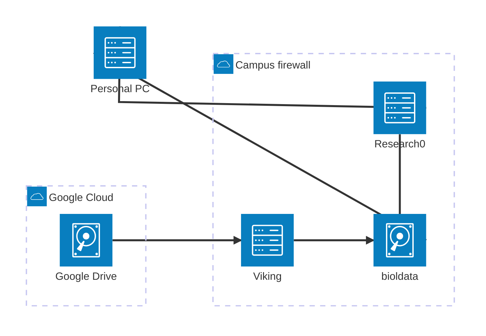

# CellPhe Data Pipeline

Runs a dataset (defined as a collection of tiffs) through the full CellPhe pipeline including:

  - Segmentation
  - Tracking
  - Frame feature extraction
  - Time-series feature extraction

This is run using `Nextflow` which provides several useful features:

  - Submits jobs to Slurm without having to write any submission scripts
  - Can resume failed pipelines from the previous succesfully completed step
  - Can automatically send emails upon completion/failure

# Architecture

The pipeline involves several machines and data storage systems as laid out below.

They are:

  - `research0`: A University research computer which can be accessed by all research staff. Initiates the pipeline and data transfer.
  - `Viking`: The University's High Performance Computing (HPC) cluster, runs all the processing
  - `bioldata`: University networked data storage that can be accessed from `research0` as well as any personal computers in the University firewall (via the VPN or wired in). Acts as the master copy of all data and is where the processed outputs are placed
  - `Google Drive`: The CellPhe2 Project shared drive where raw data is deposited.



# Running the Pipeline

## Prerequisites

  1. Ensuring access to `research0`
  2. Ensuring access to `Viking`
  3. Adding public/private key authentication

### Ensuring access to `research0`

`research0` is a powerful Linux computer that resides on Campus that can be used for research purposes, typically executing long-running programs to free up your personal computer or to access licenced software.
It is used for the data pipeline as it is on the fast campus connection to the Viking service and it means you don't need to leave your laptop running while the pipeline executes.

All members of the University should be able to access `research0` **provided you are connected to Eduroam or are on the [VPN](https://www.york.ac.uk/it-services/tools/vpn/)**.
If you are on Windows open up PowerShell (NB: I highly recommend changing the background to black), Mac users can use the Terminal, and run `ssh <username>@research0`.
As shown below, this should ask for your password and then display a welcome message. 


If this doesn't work, follow the [documentation on the Wiki](https://uoy.atlassian.net/wiki/spaces/RCS/pages/39158543/Accessing+the+Servers).

### Ensuring access to Viking

Unlike `research0`, access to Viking is granted upon request rather than by default.
Ensure you have applied via [this form](https://docs.google.com/forms/d/e/1FAIpQLSfXkL10ypU6EQCBB2jS5oDwTpRMo77ppl7dvdbLnXm5zrKR7Q/viewform), with the Project Code `biol-imaging-2024`.
We don't need access to any restricted licenced software.
Once this has been granted, you can SSH into Viking in the same way as `research0`.


### Adding public/private key authentication

The final step of preparation is to facilitate password-less SSH connection from `research0` to `Viking` so that the entire pipeline can be run without any user input.
This is an alternative form of authentication to username & password which creates a pair of two 'keys', a public and a private.
The private one is associated with a specific machine (in this instance `research0`) and the public one is distributed to anywhere you wish to connect to (in this instance Viking, but it can also be used to authenticate to GitHub).

Run the following instruction on `research0` to create the pair, accepting the defaults for the 3 options (location, passphrase, passphrase confirmation):

`ssh-keygen -t ed25519 -C "research0"`

The public key now needs to be placed onto Viking so your user can be authenticated from `research0`.
Run `nano ~/.ssh/id_ed25519.pub` to open the key in the Nano text editor (still on `research0`). 
Highlight the text with the cursor and right click to copy it, then exit Nano with Ctrl-X

Now SSH into Viking and run the following command to open the Authorized Keys file, which is where the SSH command looks to see if the connecting machine has a registered SSH key: `nano ~/.ssh/authorized_keys`
By default there is already a key present: the "Flight HPC Cluster Key", so press the down arrow key to move to a new line and then right click to paste your `research0` key.
Save this with Ctrl-O then Enter, then exit Nano with Ctrl-X.

If you now disconnect from Viking (Ctrl-D) and try to reconnect, it should login you in using your SSH keys without needing your password.
If this doesn't work, try again or ask for help in Slack.

## Running

The `research0` machine has the `bioldata` storage already mounted, you can access the CellPhe share by running `cd /shared/storage/bioldata/bl-cellphe` (`cd` stands for Change Directory).
**NB: tab-completion saves a lot of time typing, i.e. after typing `cd /sh` if you press Tab it will autocomplete the rest of the word `shared`**

You can see all the files and folders with `ls` (List Directory) which should show you the same as below:

```Shell
sl561@research0:~$ cd /shared/storage/bioldata/bl-cellphe/
sl561@research0:/shared/storage/bioldata/bl-cellphe$ ls
 04092024_B2_7_imagedata              16112019_D3_1_Phase-watching_cells  'Flow data'            some_data.txt       zip-folders.py
 07082024_B2_3_rois-watching_cells    CellPhe-data-pipeline               'Livecyte data'        test.txt
 16112019_A3_4_Phase-watching_cells   Datasets                            'Processed datasets'   watching-cells.py
```

Change into the `CellPhe-data-pipeline` directory with (again tab-complete helps), where a number of files exist.

```Shell
sl561@research0:/shared/storage/bioldata/bl-cellphe$ cd CellPhe-data-pipeline/
sl561@research0:/shared/storage/bioldata/bl-cellphe/CellPhe-data-pipeline$ ls
bin  nextflow.config  process_dataset.nf  process_dataset.sh  README.md  run.sh
```

`run.sh` is the pipeline launcher and it takes 3 arguments:

- 1. ID of the folder on GoogleDrive containing the images
- 2. Desired output folder name
- 3. A pattern matching the images

The screenshot below shows how to obtain the ID of the Google Drive folder `CellPhe2 Project/LiveCyte Data/June 14 drug - Outputs/Raw Data/2024-06-14_15-18-15/Images` by navigating to the folder in a web-browser and copying the last string of letters and numbers (highlighted).


This folder contains multiple timelapses from different wells and modalities, such as `C5_7_Phase`, `C5_7_Brightfield`, `C4_5_Phase`, `C4_5_Brightfield`.
Only one of these can be run through the pipeline at once, so let's take the `C4_5_Phase` as an example.
A sensible name for the output folder might be `2024-06-14-Drug-C4_5_Phase`, which would make the pipeline command as below.

`./run.sh 11rMHhF8fWPutVpvdzdWZy2-14ompW8Wc 2024-06-14-Drug-C4_5_Phase C4_5_Phase`

Running this command starts the pipeline, which should now run without any further input until completion.
The first step it takes is to copy the specified images (and the companion.ome file if present) over to Viking, which can take several minutes depending on the dataset size.

```Shell
sl561@research0:/shared/storage/bioldata/bl-cellphe/CellPhe-data-pipeline$ ./run.sh 11rMHhF8fWPutVpvdzdWZy2-14ompW8Wc 2024-06-14-Drug-C4_5_Phase C4_5_Phase
2025/01/21 09:18:04 INFO  : C4_5_Phase.companion.ome: Copied (new)
2025/01/21 09:18:10 INFO  : C4_5_Phase_10.ome.tiff: Copied (new)
2025/01/21 09:18:11 INFO  : C4_5_Phase_11.ome.tiff: Copied (new)
2025/01/21 09:18:11 INFO  : C4_5_Phase_1.ome.tiff: Copied (new)
2025/01/21 09:18:12 INFO  : C4_5_Phase_12.ome.tiff: Copied (new)
2025/01/21 09:18:16 INFO  : C4_5_Phase_13.ome.tiff: Copied (new)
2025/01/21 09:18:18 INFO  : C4_5_Phase_15.ome.tiff: Copied (new)
2025/01/21 09:18:18 INFO  : C4_5_Phase_14.ome.tiff: Copied (new)
2025/01/21 09:18:18 INFO  : C4_5_Phase_16.ome.tiff: Copied (new)
```

After this, the pipeline begins in earnest, starting with splitting the .ome.tiff files into their constituent frames (in this example the 33 .ome.tiff files correspond to 721 frames), before the segmentation, tracking, and CellPhe feature extraction are run.
If the dataset isn't OME.TIFF then this splitting is skipped and it jumps straight into the segmentation.
The segmentation (`segment_image`) and CellPhe feature extraction (`cellphe_frame_features_image`) steps are run on each frame in parallel and are what makes running the pipeline far quicker than on a personal computer.
The tracking (`track_images`) step is run in one go and can take around 15 minutes depending on the dataset.
Of the remaining 3 CellPhe steps (`combine_frame_features`, `create_frame_summary_features`, `cellphe_time_series_features`), only the time-series features actually does any serious computation and even then only takes a few minutes.

```Shell
executor >  local (724), slurm (721)
[de/a9e62b] process > ome_get_filename              [100%] 1 of 1 ✔
[84/c7c0ef] process > ome_get_frame_t               [100%] 1 of 1 ✔
[3c/d3b7d1] process > ome_get_global_t              [100%] 1 of 1 ✔
[70/a8ba7b] process > split_ome_frames (721)        [100%] 721 of 721 ✔
[0b/9700b5] process > segment_image (98)            [ 13%] 100 of 721
[-        ] process > track_images                  -
[-        ] process > cellphe_frame_features_image  -
[-        ] process > combine_frame_features        -
[-        ] process > create_frame_summary_features -
[-        ] process > cellphe_time_series_features  -
```

Occasionally you might encounter an error such as below.
Not to worry, these jobs will be resubmitted to Viking but with additional resources (i.e. time and memory) so that they should successfully complete.

```Shell
[40/e027a1] NOTE: Process `segment_image(20)` terminated with an error exit status (140) -- Execution is retried (1)
```

Once the job has completed there will be a summary detailing how long the job took (note that this particular example took 13 minutes in real-time, but used 6 computer hours, how long it would have taken without parallelisation).
The pipeline outputs are then transferred to `bioldata` where they can be seen in the `Datasets` folder.

The outputs are:

  - `frame_features.csv`
    - The 74 CellPhe features calculated on every frame for every cell
    - Each row corresponds to a different cell (`CellID`) on a different frame (`FrameID`) where the ROI filename is given in `ROI_filename`. All the other columns are the features
  - `time_series_features.csv`
    - The 72 frame features (the 74 from before excluding `x` and `y` positions) summarised across each cell's time-series
    - Each row corresponds to a different cell (`CellID`) with 1080 time-series summary features (72 features summarized with 15 different methods) plus an overall summary of the area covered `trajArea`
  - `raw`
    - The raw images
  - `frames`
    - If the dataset was OME.TIFF then this folder exists and contains the ome.tiffs split into a single tiff per frame
    - Not present if the dataset wasn't OME.TIFF
  - `masks`
    - The CellPose segmentation masks
  - `rois.zip`
    - The ROIs - can be opened directly in ImageJ
  - `trackmate_features.csv`
    - The output from the TrackMate tracking

```Shell
executor >  local (724), slurm (1446)
[de/a9e62b] process > ome_get_filename               [100%] 1 of 1 ✔
[84/c7c0ef] process > ome_get_frame_t                [100%] 1 of 1 ✔
[3c/d3b7d1] process > ome_get_global_t               [100%] 1 of 1 ✔
[70/a8ba7b] process > split_ome_frames (721)         [100%] 721 of 721 ✔
[77/9e25bf] process > segment_image (721)            [100%] 721 of 721 ✔
[b6/b2ebf1] process > track_images                   [100%] 1 of 1 ✔
[51/62eeec] process > cellphe_frame_features_imag... [100%] 721 of 721 ✔
[5f/d79589] process > combine_frame_features         [100%] 1 of 1 ✔
[2c/f492d4] process > create_frame_summary_features  [100%] 1 of 1 ✔
[d5/ef354c] process > cellphe_time_series_features   [100%] 1 of 1 ✔
Completed at: 21-Jan-2025 09:32:12
Duration    : 13m 1s
CPU hours   : 6.3
Succeeded   : 2'170


2025/01/21 09:32:17 INFO  : time_series_features.csv: Copied (new)
2025/01/21 09:32:17 INFO  : raw/C4_5_Phase.companion.ome: Copied (new)
2025/01/21 09:32:18 INFO  : trackmate_features.csv: Copied (new)
2025/01/21 09:32:20 INFO  : raw/C4_5_Phase_10.ome.tiff: Copied (new)
2025/01/21 09:32:20 INFO  : raw/C4_5_Phase_1.ome.tiff: Copied (new)
2025/01/21 09:32:20 INFO  : rois.zip: Copied (new)
2025/01/21 09:32:21 INFO  : frame_features.csv: Copied (new)
2025/01/21 09:32:21 INFO  : raw/C4_5_Phase_12.ome.tiff: Copied (new)
2025/01/21 09:32:22 INFO  : raw/C4_5_Phase_11.ome.tiff: Copied (new)
...
2025/01/21 09:36:41 INFO  : frames/frame_00719.tiff: Copied (new)
2025/01/21 09:36:41 INFO  : frames/frame_00720.tiff: Copied (new)
2025/01/21 09:36:41 INFO  :
Transferred:        1.932 GiB / 1.932 GiB, 100%, 5.453 MiB/s, ETA 0s
Transferred:         1480 / 1480, 100%
Elapsed time:      4m27.2s

sl561@research0:/shared/storage/bioldata/bl-cellphe/CellPhe-data-pipeline$ cd ../Datasets/2024-06-14-Drug-C4_5_Phase/
sl561@research0:/shared/storage/bioldata/bl-cellphe/Datasets/2024-06-14-Drug-C4_5_Phase$ ls
frame_features.csv  frames  masks  raw  rois.zip  time_series_features.csv  trackmate_features.csv
```

# Tips

## Tmux

If you are on an unstable connection, or just want the added security, you can run the pipeline from within a `tmux` session which means that if your connection to `research0` is lost then the pipeline won't terminate.
To do so, simply run `tmux` after connecting to `research0` then run the pipeline as usual.
If your SSH connection is later lost, you can reconnect to `research0` and run `tmux attach` and it will resume your last session with the pipeline still running.
To exit a `tmux` session press Ctrl-D, and a second Ctrl-D to disconnect from `research0` itself.

## Mapping bioldata on personal machine

To be able to access the outputs on your personal computer, you can map the `bioldata` network drive following the instructions on the [University's documentation](https://support.york.ac.uk/s/article/Filestore-How-to-map-a-drive-Windows), using the path `\\storage.its.york.ac.uk\bioldata\bl-cellphe`.
**NB: you'll need to either be wired onto the campus network or connected to the VPN to read the network drive**.

## Settings

The pipeline currently runs with the default options for segmentation and tracking, although later on we hope to make it possible to configure these.
As such it might be sensible to suffix output folders with `_default` to indicate these outputs were generated using the default configuration, so later on pipelines experimenting with different parameters can be run and easily compared.

## QA/QC

Another upcoming feature is the ability to view automated QC reports to summarise the segmentation and tracking quality.
