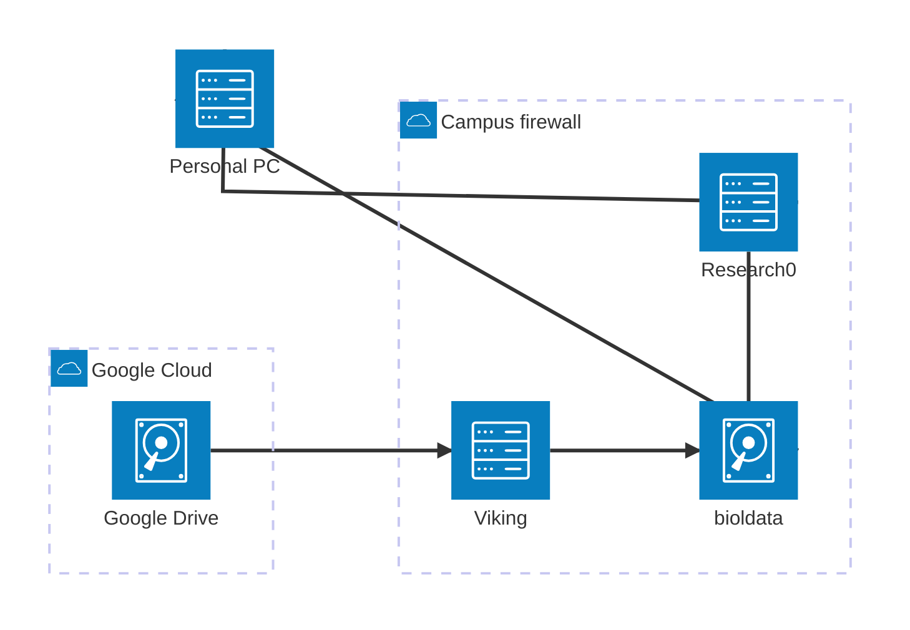
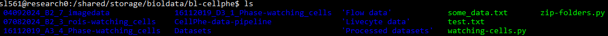
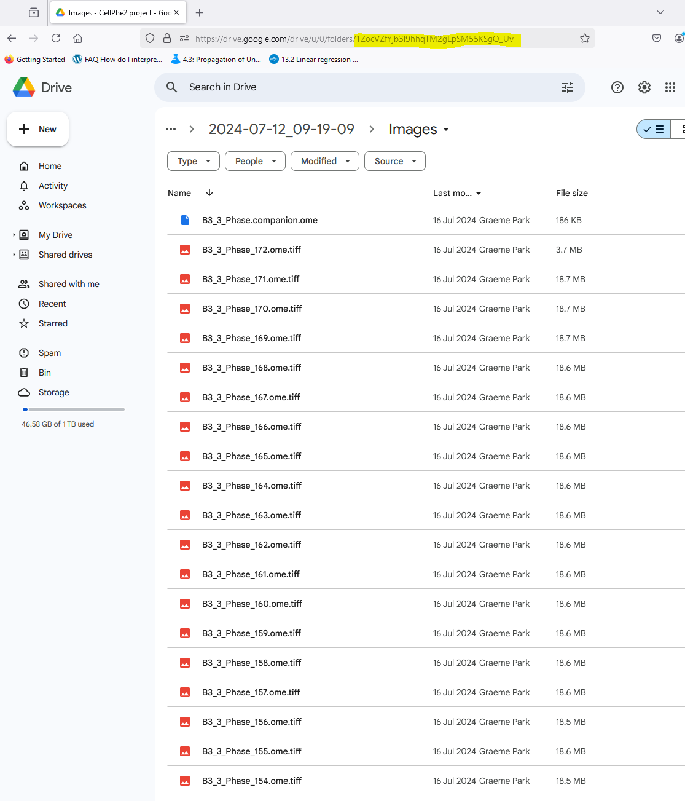
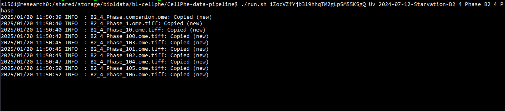
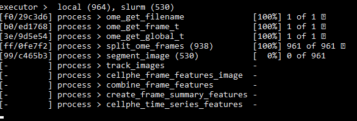
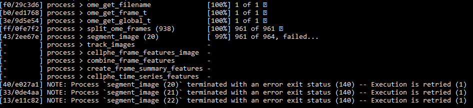

# CellPhe Data Pipeline

Runs a dataset (defined as a collection of tiffs) through the full CellPhe pipeline including:

  - Segmentation
  - Tracking
  - Frame feature extraction
  - Time-series feature extraction

This is run using `Nextflow` which provides several useful features:

  - Submits jobs to Slurm without having to write any submission scripts
  - Can resume failed pipelines from the previous succesfully completed step
  - Can automatically send emails upon completion/failure

Full instructions will be made available soon.

# Data transfer diagram

# Running the Pipeline

## Prerequisites

  1. Ensuring access to `research0`
  2. Ensuring access to `Viking`
  3. Adding public/private key authentication to Viking

### Ensuring access to `research0`

`research0` is the name of a powerful Linux computer that resides on Campus that can be used for research purposes, typically executing long-running programs on it to free up your personal computer or to access licenced software.
It is used for the data pipeline as it is on the fast campus connection to the Viking service and using it frees up your laptop while the pipeline is executing.

All members of the University should be able to access it **provided you are connected to Eduroam or are on the [VPN](https://www.york.ac.uk/it-services/tools/vpn/)**.
If you are on Windows open up PowerShell (NB: I highly recommend changing the background to black), Mac users can use the Terminal, and run `ssh <username>@research0`.
As shown below, this should ask for your password and then display a welcome message. 

If this doesn't work, follow the [documentation on the Wiki](https://uoy.atlassian.net/wiki/spaces/RCS/pages/39158543/Accessing+the+Servers).

### Ensuring access to Viking

Unlike `research0`, access to Viking is given out upon request rather than automatically.
Ensure you have applied via [this form](https://docs.google.com/forms/d/e/1FAIpQLSfXkL10ypU6EQCBB2jS5oDwTpRMo77ppl7dvdbLnXm5zrKR7Q/viewform), with the Project Code `biol-imaging-2024`.
We don't need access to any restricted licenced software.

Once this has been granted, you can SSH into Viking in the same way as `research0`.

### Adding public/private key authentication to Viking

The final step of preparation is to facilitate password-less SSH connection from `research0` to `Viking` so that the entire pipeline can be run without user input prompting for your password.
This is an alternative form of authentication to username & password which creates a pair of two 'keys', a public and a private.
The private one is associated with a specific machine (in this instance `research0`) and the public one is distributed to anywhere you wish to connect to (in this instance Viking, but it can also be used to authenticate to GitHub for example).

Run the following instruction to create the pair, accepting the defaults for the 3 options (location, passphrase, passphrase confirmation).

`ssh-keygen -t ed25519 -C "research0"`

The final step is to place the public key onto Viking so it can authenticate you.

Run `nano ~/.ssh/id_ed25519.pub` to open the key in the Nano text editor. 
Highlight the text with the cursor and right click to copy it, then exit Nano with Ctrl-X

Now SSH into Viking and open run the following command to open the Authorized Keys file, which is where the SSH command looks at an attempted login to see if the connecting machine has an SSH key registered.

`nano ~/.ssh/authorized_keys`

By default there is one already there, the "Flight HPC Cluster Key", so press the down arrow key to move to a new line and then right click to paste your `research0` key.
Save this with Ctrl-O then Enter, then exit Nano with Ctrl-X.
If you now disconnect from Viking (Ctrl-D) and try to reconnect, it should login you in using your SSH keys and not ask for your password.
If this doesn't work, try again or ask for help in Slack.

## Running

The `research0` machine has the `bioldata` storage already mounted, which is where the pipeline code is run from.
After SSHing into `research0`, change into the CellPhe share on `bioldata` with `cd /shared/storage/bioldata/bl-cellphe` (`cd` stands for Change Directory).
**NB: tab-completion saves a lot of time typing, i.e. after typing `cd /sh` if you press Tab it will autocomplete the rest of the word `shared`**

You can see all the files and folders with `ls` (List Directory) which should show you the same as below:

Change into the `CellPhe-data-pipeline` directory with `cd CellPhe-data-pipeline` (again tab-complete helps), where `ls` will show that a number of files exist.
`run.sh` is the one that runs the pipeline and it takes 3 arguments:

  - 1. ID of the folder on GoogleDrive containing the images
  - 2. Desired output folder name
  - 3. A pattern matching the images

For example, the screenshot below shows how to obtain the ID of the Google Drive folder `CellPhe2 Project/LiveCyte Data/June12 - Outputs/July12 starvation - Outputs/Raw Data/2024-07-12_09-19-09/Images` by navigating to the folder in a web-browser and copying the last string of letters and numbers (highlighted).

This folder contains multiple timelapses from different wells and modalities, such as `B3_3_Phase`, `B3_3_Brightfield`, `B2_4_Phase`, `B2_4_Brightfield`.
Only one of these can be run through the pipeline at once, so let's take the `B2_4_Phase` as an example.
A sensible name for the output folder might be `2024-07-12-Starvation-B2_4_Phase`, which would make the pipeline command:

This means run the pipeline using images from the Google Drive folder with that ID, but only take images that match the pattern `B2_4_Phase`, and save these in the bioldata folder `Datasets/2024-07-12-Starvation-B2_4_Phase`.

`./run.sh 1ZocVZfYjb3l9hhqTM2gLpSM55KSgQ_Uv 2024-07-12-Starvation-B2_4_Phase B2_4_Phase`

The first step in the pipeline is to copy the files over to Viking from Google Drive, this can take around 5 minutes.

After this, the pipeline begins in earnest, starting with splitting the .ome.tiff files into their constituent frames (in this example the 172 .ome.tiff files correspond to 961 frames), before the segmentation, tracking, and CellPhe feature extraction are run.
The segmentation (`segment_image`) and CellPhe feature extraction (`cellphe_frame_features_image`) steps are run on each frame in parallel so should be fast.
The tracking (`track_images`) step is run in one go and can take around 15 minutes depending on the dataset.
Of the remaining 3 CellPhe steps (`combine_frame_features`, `create_frame_summary_features`, `cellphe_time_series_features`), only the time-series features actually does any serious computation and even then only takes a few minutes.

Occasionally you might encounter an error such as below.
Not to worry, these jobs will be resubmitted to Viking but with additional resources (i.e. time and memory) so that they should successfully complete.

TODO screenshot of data transfer back up and how to find files

## Tips

If you are on an unstable connection, or just want the added security, you can run the pipeline from within a `tmux` session which means that if your connection to `research0` is lost then the pipeline won't terminate.
To do so, simply run `tmux` after connecting to `research0`. 
Now, if your SSH connection is lost, you can reconnect to `research0` and run `tmux attach` and it will resume your last session with the pipeline still running.
To exit a `tmux` session press Ctrl-D, and a second Ctrl-D to disconnect from `research0` itself.
